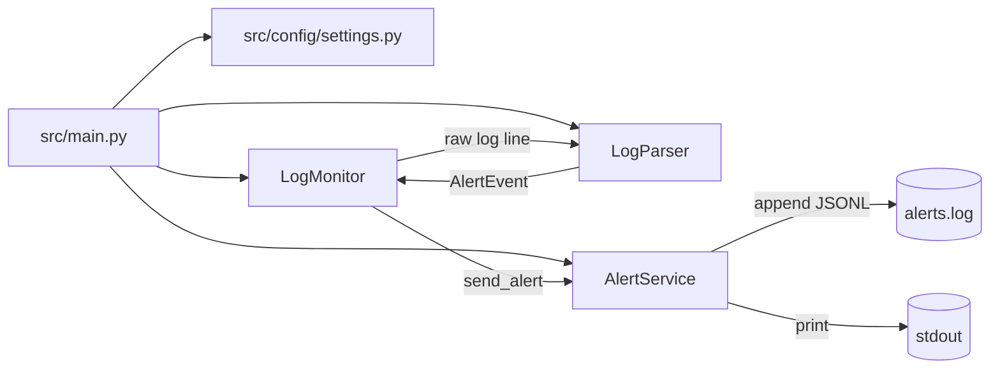

# Documentación completa — Docker Log Monitoring App

Este repositorio implementa una aplicación en Python para **monitorear en tiempo real los logs de uno o varios contenedores Docker**, detectar **palabras clave** configurables (por ejemplo `ERROR`, `Exception`, `timeout`) y generar **eventos de alerta**.

La aplicación puede ejecutarse en:

- **Modo consola (CLI):** imprime alertas y escribe un archivo **JSON Lines (JSONL)**.
- **Modo GUI (Tkinter):** permite iniciar/detener monitoreo, ver alertas en una tabla y ver contadores/gráficas simples por keyword y por contenedor.

## Tabla de contenidos

1. [Qué hace y qué no hace](#qué-hace-y-qué-no-hace)
2. [Estructura del proyecto](#estructura-del-proyecto)
3. [Quickstart (consola)](#quickstart-consola)
4. [Quickstart (GUI)](#quickstart-gui)
5. [Configuración (.env)](#configuración-env)
6. [Formato de salida (JSONL)](#formato-de-salida-jsonl)
7. [Arquitectura interna](#arquitectura-interna)
8. [Flujo paso a paso (CLI)](#flujo-paso-a-paso-cli)
9. [Flujo paso a paso (GUI)](#flujo-paso-a-paso-gui)
10. [Generador de logs (Docker)](#generador-de-logs-docker)
11. [Pruebas](#pruebas)
12. [Puntos de extensión](#puntos-de-extensión)

---

## Qué hace y qué no hace

**Sí hace**:

- Se conecta al Docker Engine local usando `docker` SDK (`docker.from_env()`).
- Abre un stream de logs (`container.logs(... follow=True, stream=True ...)`).
- Procesa cada línea como streaming y detecta keywords _case-insensitive_.
- Cuando hay match, genera un `AlertEvent` y lo:
  - imprime en consola
  - agrega a memoria (`AlertService.alerts`)
  - opcionalmente escribe como JSONL en un archivo.
- Permite monitorear múltiples contenedores en paralelo (un hilo por contenedor).

**No hace** (importante para entender el alcance):

- No usa regex: el matching es por _substring_ (contención) en minúsculas.
- No agrega niveles de severidad estructurados ni throttling.
- No envía alertas a Slack/HTTP/email (solo consola + archivo + callback opcional).
- No persiste estado más allá del archivo JSONL.

---

## Estructura del proyecto

```
log-monitoring-app/
  src/
    main.py
    config/settings.py
    monitors/log_monitor.py
    parsers/log_parser.py
    services/alert_service.py
    gui/tk_app.py
    types/__init__.py
  docker/log-generator/
    Dockerfile
    docker-compose.yml
    generate_logs.py
  tests/test_log_monitor.py
  requirements.txt
  README.md
  COMO_FUNCIONA.md
  REQUERIMIENTOS.md
```

---

## Quickstart (consola)

1. Instalar dependencias:

```bash
pip install -r requirements.txt
```

2. Crear `.env` en la raíz (puedes basarte en `.env.example`):

```dotenv
DOCKER_CONTAINERS=api,worker
ERROR_KEYWORDS=ERROR,CRITICAL,Exception,timeout,connection refused
ALERT_LOG_FILE=alerts.log
```

3. Ejecutar el monitor:

```bash
python -m src.main
```

---

## Quickstart (GUI)

```bash
python -m src.main --gui
```

En la pestaña **Monitor**:

- `Start`: inicia el monitoreo en background.
- `Stop`: lo detiene.
- `Clear`: limpia la tabla, contadores y gráficas.

En la pestaña **Configuración**:

- Edita contenedores/keywords/archivo.
- `Detect running`: llena contenedores detectando los activos en Docker.
- `Load` / `Save`: carga/guarda `.env`.

---

## Configuración (.env)

La configuración se lee en [src/config/settings.py](src/config/settings.py) usando `python-dotenv`:

- `DOCKER_CONTAINERS`: CSV. Default: `api`.
- `ERROR_KEYWORDS`: CSV. Default: `DEFAULT_KEYWORDS`.
- `ALERT_LOG_FILE`: ruta del archivo de salida. Default: `alerts.log`.

Detalles de parseo:

- Se recortan espacios y se ignoran elementos vacíos.
- Si una variable está ausente o vacía, se usa el default.

---

## Formato de salida (JSONL)

Cada alerta se serializa como JSON y se escribe **una por línea** (JSONL). Ejemplo:

```json
{
  "timestamp": "2026-01-01T00:00:00+00:00",
  "container_name": "api",
  "message": "ERROR: database unavailable",
  "matched_keyword": "ERROR"
}
```

Estructura (ver [src/types/**init**.py](src/types/__init__.py)):

- `timestamp`: ISO8601 en UTC.
- `container_name`: nombre del contenedor.
- `message`: línea de log (normalizada).
- `matched_keyword`: keyword que hizo match.

---

## Arquitectura interna

Componentes principales:

1. **Settings** ([src/config/settings.py](src/config/settings.py))
   - Carga `.env` y construye `Settings`.

2. **LogMonitor** ([src/monitors/log_monitor.py](src/monitors/log_monitor.py))
   - Se conecta a Docker, abre streams de logs y procesa líneas.
   - Concurrencia: crea **un thread por contenedor**.
   - Expone callbacks opcionales `on_info` y `on_error` (usados por la GUI).

3. **LogParser** ([src/parsers/log_parser.py](src/parsers/log_parser.py))
   - Normaliza la línea.
   - Detecta keywords (_case-insensitive_).
   - Produce `AlertEvent` o `None`.

4. **AlertService** ([src/services/alert_service.py](src/services/alert_service.py))
   - Emite la alerta (print + memoria + archivo JSONL).
   - Soporta `on_alert` callback (clave para la GUI).

### Diagrama (alto nivel)



---

## Flujo paso a paso (CLI)

Entrada: [src/main.py](src/main.py)

1. **Parseo de argumentos**
   - Si usas `--gui`, el flujo cambia (ver sección GUI).

2. **Carga de configuración**
   - `settings = get_settings()`
   - Se crean `containers`, `error_keywords`, `alert_log_file`.

3. **Construcción de dependencias**
   - `alert_service = AlertService(alert_log_file=...)`
   - `parser = LogParser(keywords=...)`
   - `log_monitor = LogMonitor(container_names=..., alert_service=..., parser=...)`

4. **Inicio del monitoreo**
   - `log_monitor.start_monitoring()`
   - `LogMonitor` crea threads.

5. **Por cada contenedor (cada thread)**
   - Obtiene el contenedor: `docker_client.containers.get(name)`
   - Abre logs: `container.logs(stream=True, follow=True, timestamps=True, ...)`
   - Itera línea por línea.

6. **Procesamiento de cada línea**
   - `alert_event = parser.parse_log(container_name, raw_line)`
   - Si `alert_event` no es `None`:
     - `alert_service.send_alert(alert_event)`

7. **Salida**
   - Consola: `print(...)`
   - Archivo: append JSONL.

8. **Parada**
   - Ctrl+C hace que `main.py` ejecute `log_monitor.stop_monitoring()`.
   - Se activa un `Event` y se cierran streams.

---

## Flujo paso a paso (GUI)

Entrada: [src/gui/tk_app.py](src/gui/tk_app.py) + `python -m src.main --gui`

1. `run_gui()` crea un `Tk()` y monta `LogMonitoringTkApp`.

2. `LogMonitoringTkApp.__init__`:
   - Carga settings iniciales (`get_settings()`) para rellenar campos.
   - Crea una `Queue` para transportar eventos thread-safe hacia el hilo UI.
   - Agenda `_poll_events()` cada 100ms con `after(100, ...)`.

3. Al presionar **Start** (`start_monitoring`):
   - Lee los CSV de contenedores/keywords desde la UI.
   - Construye `AlertService(on_alert=...)` para encolar eventos.
   - Construye `LogMonitor(on_info=..., on_error=...)`.
   - Llama `start_monitoring(daemon=True)` para no bloquear la UI.

4. Recepción de eventos:
   - `AlertService.send_alert` ejecuta `on_alert(alert_event)`.
   - La GUI encola el evento en `_event_queue`.
   - `_poll_events` drena la cola y actualiza:
     - tabla
     - contadores
     - canvas de gráficas

5. **Stop** (`stop_monitoring`):
   - `LogMonitor.stop_monitoring()` activa stop y cierra streams.

6. **Load/Save .env**:
   - `load_from_env`: parsea `.env` manualmente y actualiza inputs.
   - `save_to_env`: actualiza o agrega claves en `.env` preservando comentarios.

---

## Generador de logs (Docker)

El repo trae un generador de logs para pruebas en [docker/log-generator](docker/log-generator).

Arranque:

```bash
docker compose -f docker/log-generator/docker-compose.yml up --build
```

Esto crea dos contenedores (por defecto `api` y `worker`).

### Variables del generador

Definidas en [docker/log-generator/generate_logs.py](docker/log-generator/generate_logs.py) (via env vars):

- `SERVICE_NAME`: nombre lógico del servicio.
- `LOG_INTERVAL_SECONDS`: intervalo entre logs.
- `ALERT_EVERY_SECONDS`: cada cuánto fuerza una alerta periódica.
- `ALLOW_RANDOM_ALERTS`: `1` habilita alertas por probabilidad.
- `ERROR_PROBABILITY`, `EXCEPTION_PROBABILITY`, `TIMEOUT_PROBABILITY`: probabilidades si lo aleatorio está habilitado.

Stop:

```bash
docker compose -f docker/log-generator/docker-compose.yml down
```

---

## Pruebas

Archivo: [tests/test_log_monitor.py](tests/test_log_monitor.py)

- Usa `FakeDockerClient` y contenedores fake para no depender de Docker real.
- Verifica:
  - que `process_log_line` genera alertas cuando hay match
  - que ignora líneas sin match
  - que el stream de `_monitor_container` produce el número esperado
  - que `AlertService` invoca el callback `on_alert`

Ejecución:

```bash
pytest
```

---

## Puntos de extensión

Cambios típicos sin romper la arquitectura:

- Matching más potente (regex, severidad, etc.): modificar [src/parsers/log_parser.py](src/parsers/log_parser.py).
- Nuevos destinos de alertas (HTTP, Slack, etc.): extender [src/services/alert_service.py](src/services/alert_service.py) o usar el callback `on_alert`.
- Métricas/telemetría: usar `on_info`/`on_error` en [src/monitors/log_monitor.py](src/monitors/log_monitor.py).

Notas:

- `AlertService.configure_alert(...)` existe como placeholder (hoy solo imprime un mensaje).
- `LogMonitor._normalize_raw_line(...)` está definido pero actualmente no se usa (la normalización real ocurre en `LogParser`).
